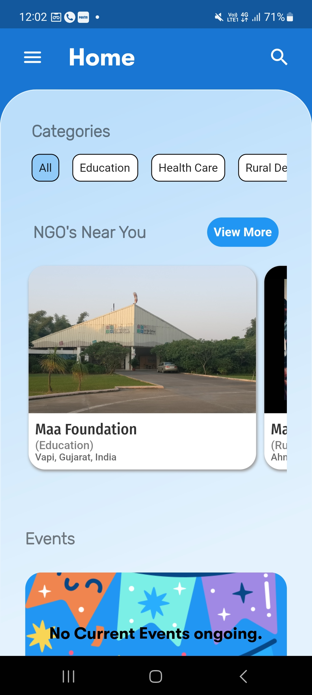
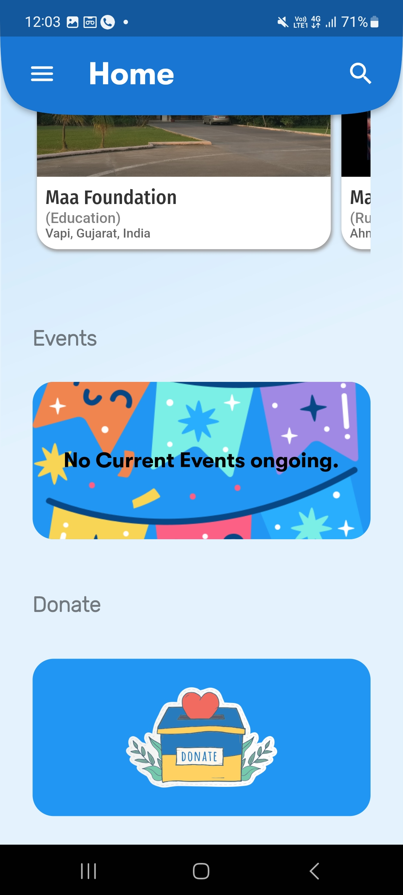
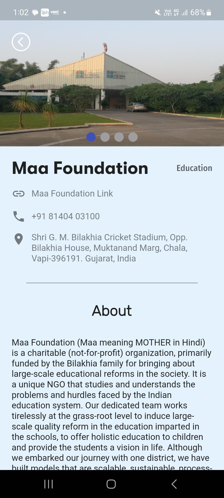
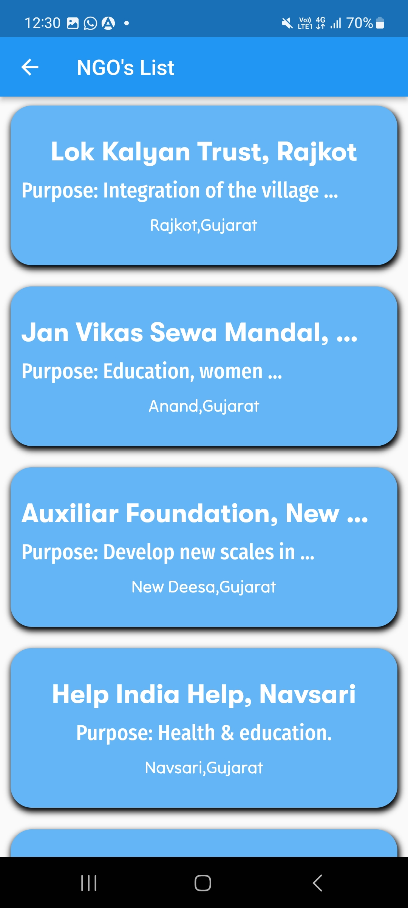
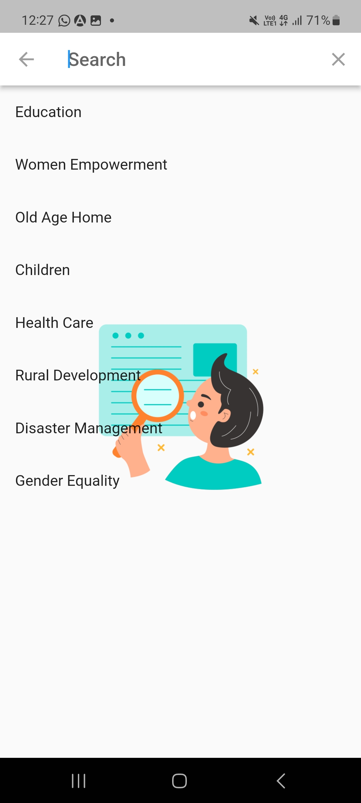
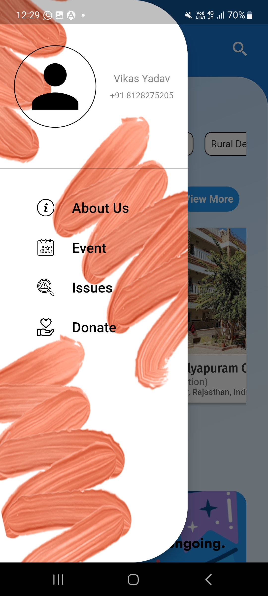
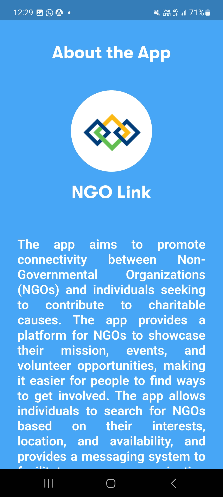

<h1> NGO Link</h1>
<i>Bridging the gap for those in need.</i>
<br/><br/>

### About NGO Link

People face difficulties reaching out for help from NGOs. They are unaware of the full range of options available to them due to the complexity of existing resources and lack of a simplistic alternative. Likewise, NGOs are unable to effectively reach and engage the target population. Smaller NGOs lack the resources to properly advertise themselves, and NGOs often lack the data and methods to track their outreach efforts and measure their impact.

With this project, we aim to reduce the effort and simplify the process of contacting and reaching out to NGOs, and to eliminate the hassle of time-consuming research. This project can run as both **Mobile App** (available for Android & iOS) and **Web App**. To run the web app, use the command:
`flutter run -d chrome`

## Features

- **Location-based Search**: Easily find NGOs near you or based on specific needs.
- **Search Functionality**: Quickly search for NGOs or events by name or category.
- **Donate Page**: A simple and quick way to donate to NGOs that need support.
- **User Engagement**: Simplifies participation in community events and social causes.
- **Mobile & Web App**: Accessible as a mobile app for Android/iOS or as a web app.

## Screenshots

Here are some screenshots showcasing the app in action:

<div class="noborder" style="overflow-x: auto;">
  <div class="noborder" style="width: 1510px;">
    
    
    
    
    
    
    
  </div>
</div>


## Installation

### Prerequisites
- Flutter
- Dart

### To Run the App:

1. Clone the repository:
```bash
git clone https://github.com/yourusername/NGO-Link.git
```

2. Navigate to the project folder:
```bash
cd NGO-Link
```

3. Install dependencies:
```bash
flutter pub get
```

4. Run the app for mobile (Android/iOS) or as a web app:
```bash
flutter run
```

---

## Directory Structure

```
├── lib/
│   ├── view_more_ngo_page.dart
│   ├── main.dart
│   ├── donate_page.dart
│   ├── view_more_ngo_card_page.dart
│   ├── Home_Page/
│   │   ├── main_screen_home_start.dart
│   │   ├── search_functionality.dart
│   │   ├── searchbar_home.dart
│   │   ├── scaffold_body.dart
│   │   ├── side_bar_menu.dart
│   │   ├── home.dart
│   │   ├── sliver_trial.dart
│   │   ├── ngo_near_you_card.dart
│   │   └── about_us.dart
│   ├── firebase_options.dart
│   ├── NGO_Card_Pages/
│   │   └── ngo_card_page.dart
│   └── messages_page.dart
├── images/
│   └── category_images/
```

---

## Contributing

We welcome contributions to improve the NGO Link project! Whether it's code improvements, bug fixes, or new features, feel free to open an issue or pull request.

---

### Developed with:

- **Flutter** for cross-platform app development (Mobile & Web)
- **Firebase** for backend services
- **Google Cloud Platform** for hosting and managing data
